Why a decision service?
-----------------------

You will learn in this section:

1- How to use your Business Object Model to automate decisions and policies.

2- The different types of authoring tools available to you.

3- How to use your automated decisions and rules.

You are in charge of automating the decisions that need to be taken to solve a dispute, solving a credit card dispute depends on several variables like  the type of customer, the amount of the dispute etc. The knowledge of how to apply this rules and decisions is tacit, lives only in the head of other domain experts like you, in order to automate the process you will have to express it in teh form of rules.
For this particular case 2 set of rules are defined for different stages on the process:

***Calculating the Risk***

The cost of processing a dispute for Pecunia Corp. is very high per dispute and totally independent of the amount that is been disputed, that is why its very important to have flexible rules that are compliant on one hand but also that take into acco time unt the profile and loyalty of Pecunia Corp. customers to solve a dispute.Right now all the process is manual, so there is a group of agents dedicated to make decisions based on the data of the dispute, this is not only expensive but also very prone to error and inconsistent.

The rules defined for the process are:

- Automatic chargeback is only available to Platinum and Gold Credit Card Holders

- The risk of the transaction is determined by the type of user and the amount of the dispute

         - Standard customer 0-100 risk low risk
	     - Standard customer 100-500 medium
         - Standard customer anything above 500 high
         - Gold customer anything less than 500 low risk
         - Gold customer anything more than 500 high risk
         - Silver customer anything between 250-500 medium low risk
         - Silver customer anything below 250  low risk

Regulations

- If the customer billing address is in the state on Texas, California or Florida the dispute should be consider of higher risk.

***The Authoring Tools ***
-----------------------------------

We have defined the Business Object Model on the last lab, so you need to import the following repository. You can watch the video on how to import a repository into your workspace

1- Import the rest of the Domain Model by importing the project Domain Model CC Dispute  from the following repository:

https://github.com/MyriamFentanes/fsi-credit-card-dispute-case.git

Now we will create the rules to process a Credit Card (CC) Dispute automatically, meaning without the need of any human intervention.

1- Select the project credit-card-dispute in the space MySpace

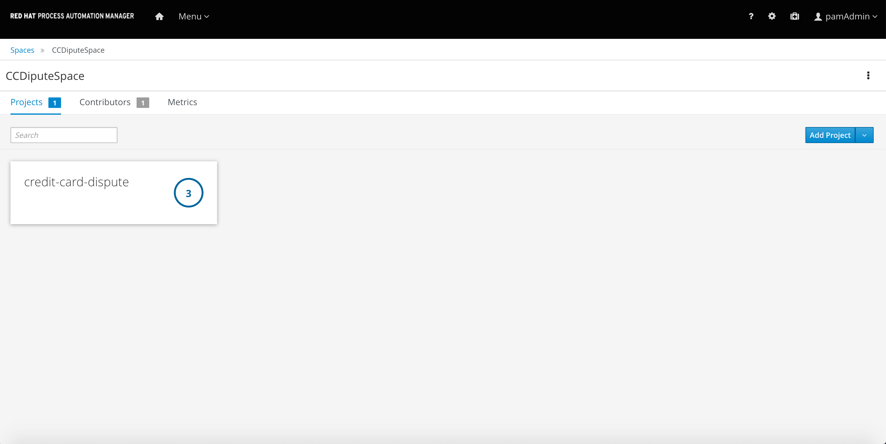

2- You will see the Domain Object Model as the only assets listed, click on the blue button Add Asset on the right upper corner of the Library View.

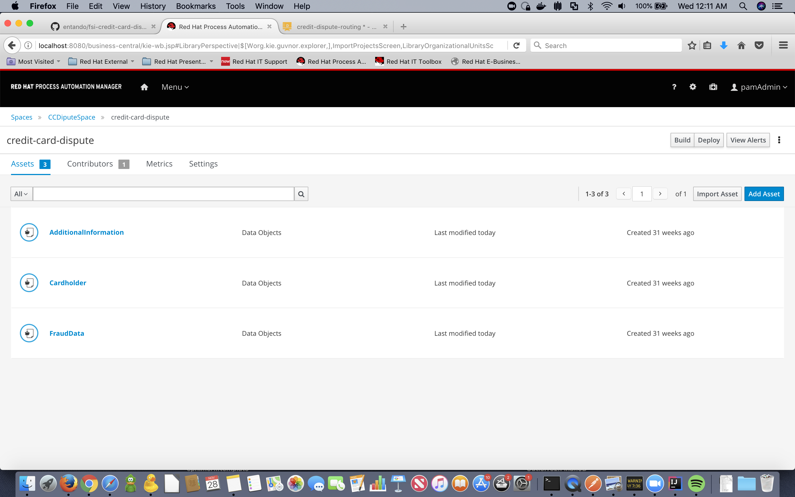

3- Select Guided Rule from the catalog of Wizards

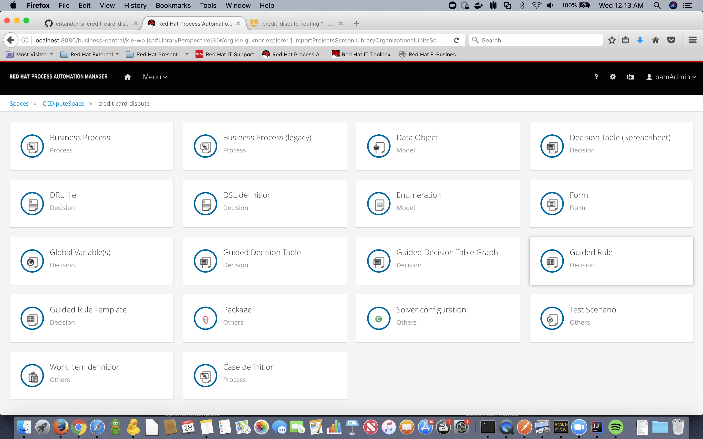

4- Set the following data in the creation wizard:

Name: `automated-chargeback`{{copy}}

Package: `com.fsi_credit_dispute`{{copy}}

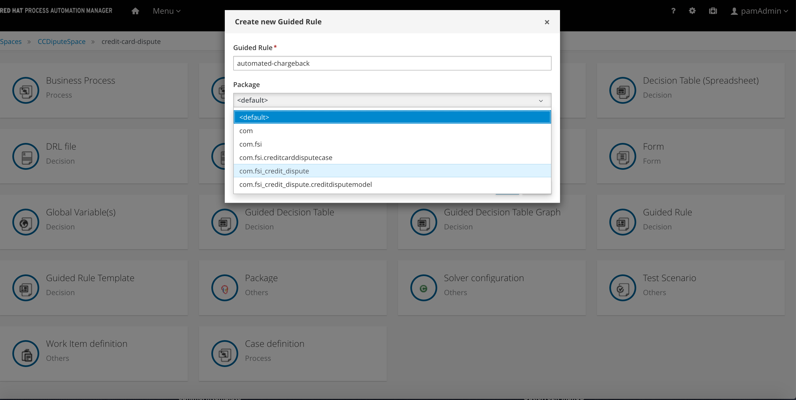

5- Click ok. You should see a banner in green telling you that the Asset was succesfully created and the wizard to author your rule.

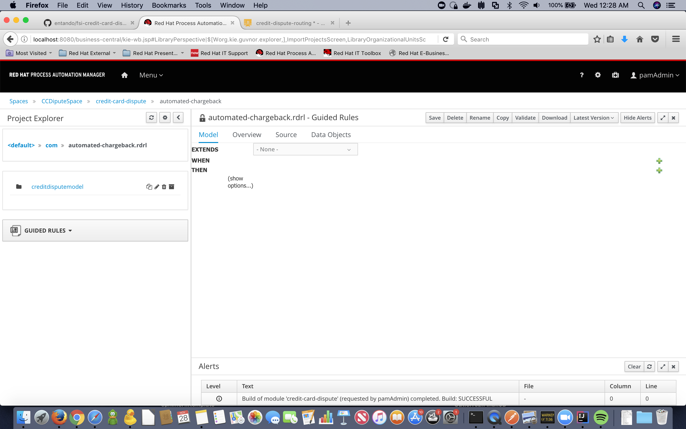

***Guided Rules ***
-----------------------------------

Guided Rules are one of the type of rules you can create in Business Central, once you have defined the Business Object Model you can use it to create rule that check conditions on the properties of the object, for example a Credit Card Holder. If the condition or conditions are met you can define an action or a decision to take:
In the case of the rules for automatic chargeback we are evaluating only the CC Holder. So lets create the rule:
First we need to tell the rule what object or collection of objects are we going to evaluate. Rules have a very basic syntax, you have the When section a.k.a teh Right Hand Side (RHS) or Conditional, here is where you put the discrimination criteria that you need to apply to CC Holders that quialify for an automated chargeback.

1- You will see 4 tabs in the wizard panel, select the tab that says Data Object

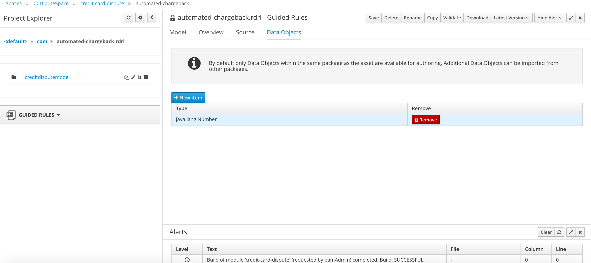

2- Click on the blue button New Item

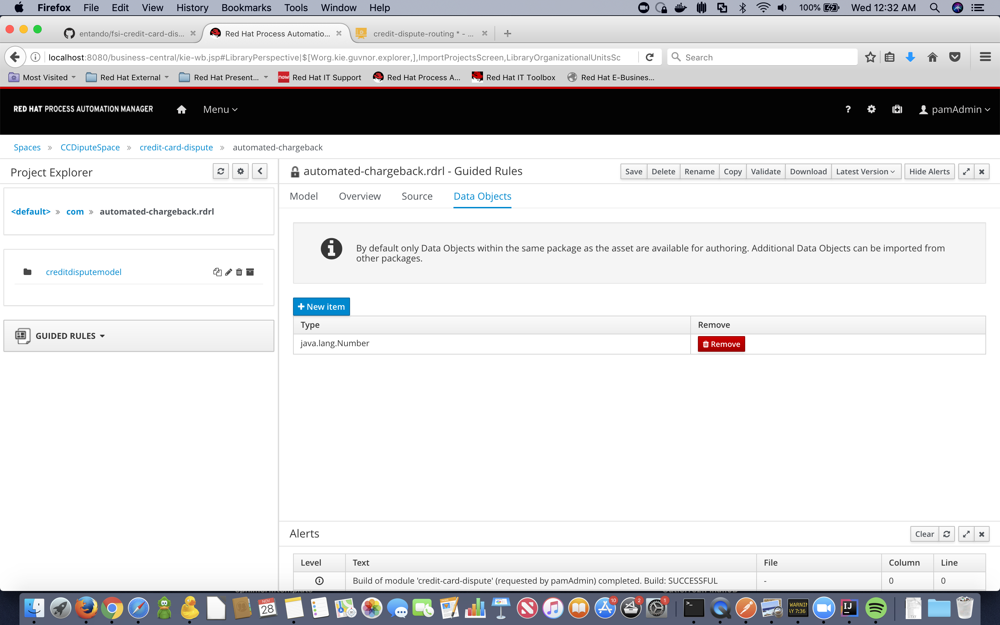

3- Choose CardHolder as the type and click ok

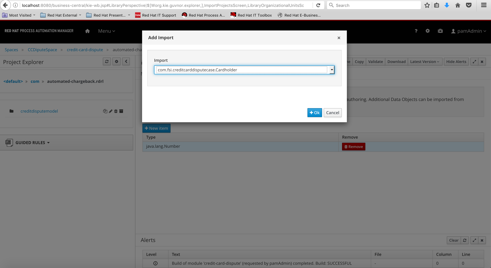

4- Return to the model tab and Click on the green cross to the right of the word When.

5- Select the object CardHolder, and click ok. We are now telling the rule engine that everytime there is a CreditCardHolder we will activate this rule.

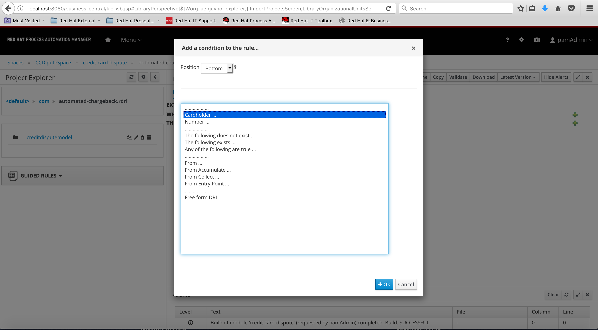

In order to match the criteria of the functional requirement we need to add another restriction, automated chargeback is only approved for CC Holders that are of type Platinum or Gold.

6- Click on the condition There is a Credit Card Holder, a new wizard opens, we aregoing to add a restriction to a field in this case the staus of the CC Holder

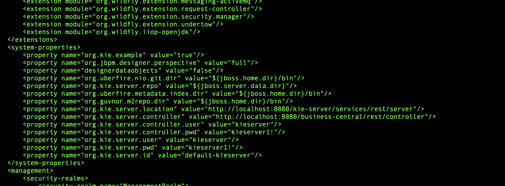

7- From the dropdown box we select that the status is contained in the list, and add the literal value of Gold and Platinum. TIP: You can also add enumerations containing this values to have them prepopulated for you.

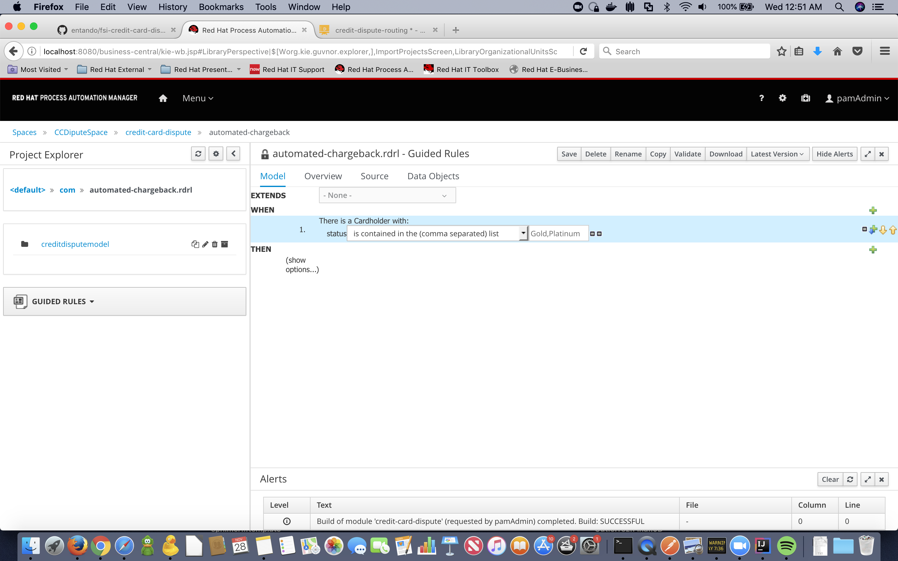

8- Complete the same procedure, to import the Fraud Data object, awe don't need to check any property of the Fraud Data just make sure that is there.

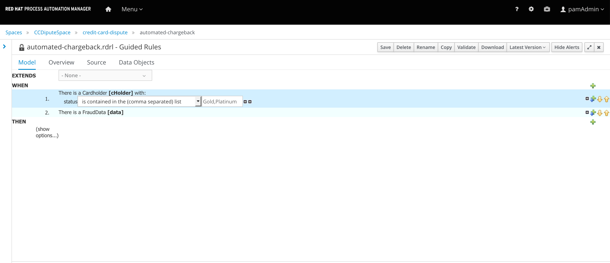

9- When you want to modify the data in the objects of the Business Model or facts, you need to store the object of the case in a variable inside the rule. Click on the fact declaration There is FraudData, the wizard to modify the constraints will open.

10- On the last field type data as the name of the variable that you want to use to store the Fraud Data object, click on the button Set

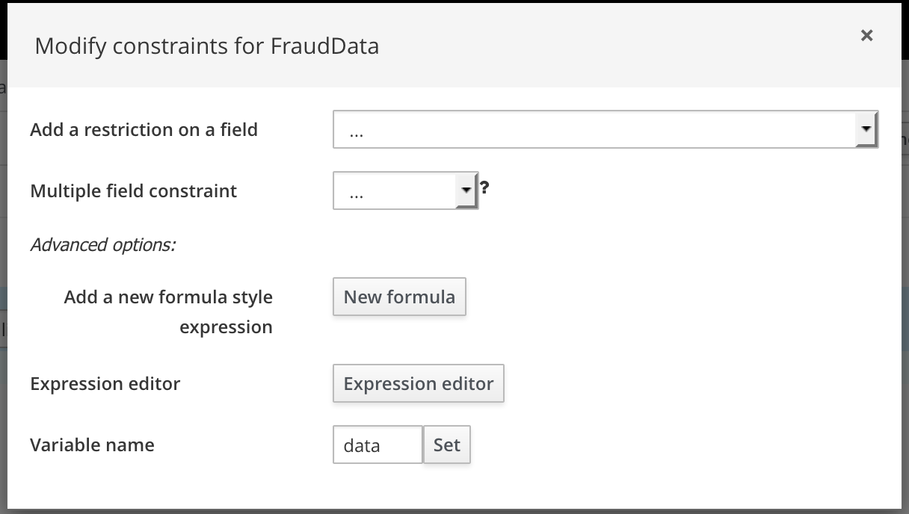

Now we are going to set the property of automated chargeback to true on the Fraud Data obeject so the dispute can be processed accordingly. Since this is the decision we are making based on the input we will define it as the WHEN clause a.k.a Left Hand Side (LHS) or Action section.
All of the information of the CC dispute is stored in facts, this facts can live in a session that the engine will keep in memory so every time you evaluate a new fact or change something, you will have all of the Object in the session available and inteviening in the decision making. In the LHS or action section you can change the values of any property on the objects that you have stored in variables, or even add new objects to the session. Everytime a property in an object changes, all of teh decisions wil be reevaluated to make sure that no other rule needs to be applied.

11- Click on the green arrow next to the WHEN keyword, when the Add new action wizard opens select Change field values of data, the variable that you created before and click on +ok.

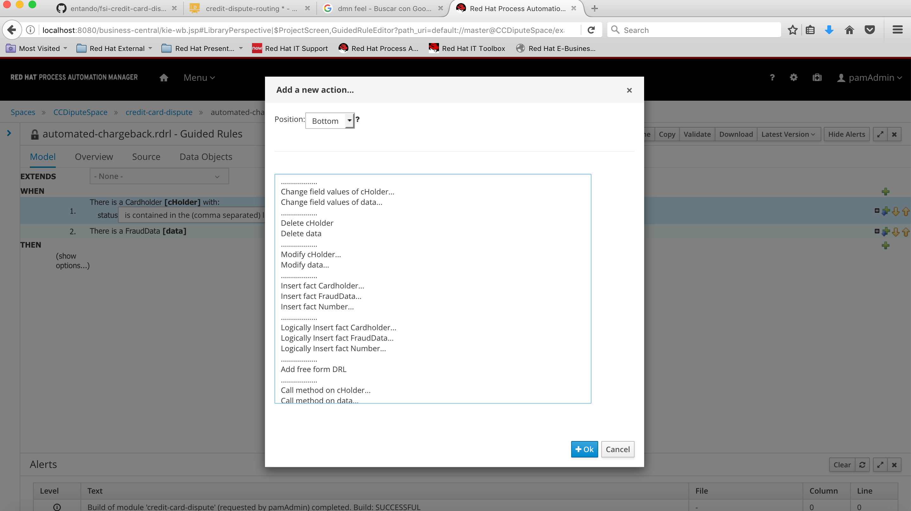

12- Now we are going to set teh value of the property automated to true, indicating that an automatic chargeback applies. Click on  the action Set value of Fraud Data and add the property automated. Click on the pencil icon to teh right and assign a literal value to the property.

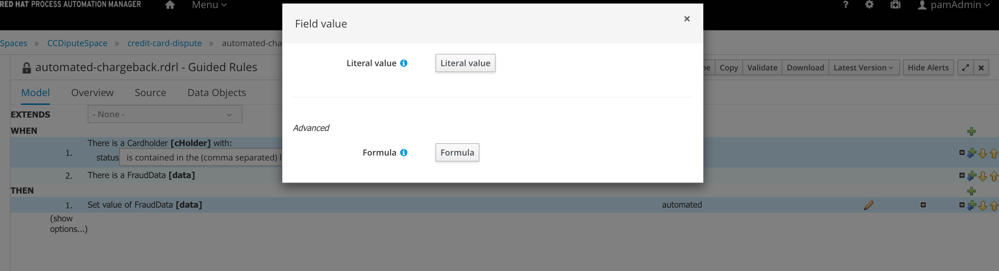

13- select true as the value for the automated property. Note that since the type of data is boolean, you can only choose between true or false

14- To validate that everything is correct click on the Validate button on the right and you should see a green "Item successfully validated!" message. Next click on Save.

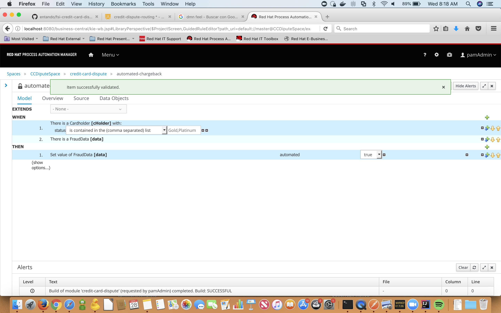

You have created your first Business Rule using the Guided editor

***DMN ***
-----------------------------------

You can also import your desicion models created in editors like Trisotech into Red Hat Process Automation Manager in the following image we can see and example of the tyoe of diagrams you can create to define the rules to calculate risk.

DMN uses a language business friendly called FEEL or Friendly Enough Expression Language.

***Decision Tables***
-----------------------------------

