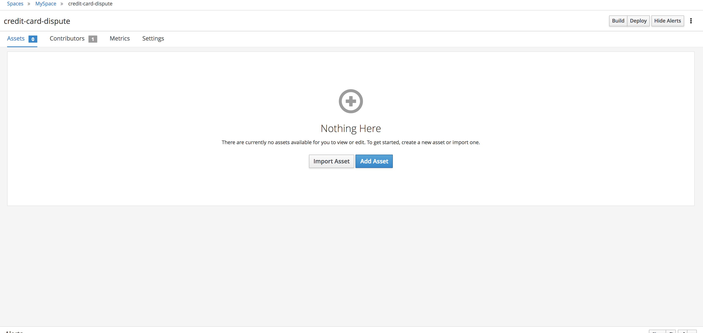
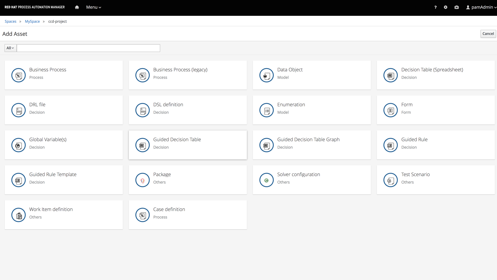

Why a decision service?
-----------------------

The credit card dispute process is not a straightforward process, it involves different actors inside and outside of the company that need to have visibility at all time of what  is happening.
So everything starts with the customer disputing a transaction.

The issuer of the credit card in this case Pecunia Corp. the actor outside of the corporation are:

- The Card Network that process the transaction and it's the connection point between the Issuer of the Credit Card in this case Pecunia Corp. and the Acquirer.
- The Acquirer the the contact point of the merchants that provide the goods or services and to whom the Issuer might need to request information.

The particular r
One of the requirements to successfully process a dispute is that all of the parties involved are aware of the dispute at all time. Since the they can all influence the final resolution of teh dispute.

For this particular case 2 set of rules were clearly defined for different stages on the process:

***Calculating the Risk***

The cost of processing a dispute for Pecunia Corp. is very high per dispute and totally independent of the amount that is been disputed, that is why its very important to have flexible rules that are compliant on one hand but also that take into acco time unt the profile and loyalty of Pecunia Corp. customers to solve a dispute.Right now all the process is manual, so there is a group of agents dedicated to make decisions based on the data of the dispute, this is not only expensive but also very prone to error and inconsistent.

The rules defined for the process are:

- Automatic process is only available to Platinum and Gold customers

         - Standard customer 0-100 risk low risk
	     - Standard customer 100-500 medium
         - Standard customer anything above 500 high

- The risk of the transaction is determined by the type of user and the amount of the dispute

         - Gold customer anything less than 500 low risk
         - Gold customer anything more than 500 high risk
         - Silver customer anything between 250-500 medium low risk
         - Silver customer anything below 250  low risk

Regulations

- If the customer billing address is in the state on Texas, California or Florida the dispute should be consider of higher risk.

***The Business Domain Context ***
-----------------------------------

You as business domain expert, need to define what is the domain model for the business capability you are trying to automate. Eric Evans coined the term Domain Driven Design that holds 3 main guiding principles: Focus on the core domain; explore models in a creative collaboration of domain practitioners and software practitioners; and speak a ubiquitous language within an explicitly bounded context. You can learn more about this design approach in his book.
So the first and very important task to automate a core business capability is to create a definition of the business entities within the context of Credit Card Dispute, in this case the first entity is the Customer, the definition in the context of our use case maybe totally different from the definition inside Pecunia Corp. but it will be common  among the team of business and technology experts.

Creating the customer entity.

1- Login to business-central web console

2- Remember that the UI was design using an activity oriented approach, in this case we want to design our Business Entity Model. Select Design from the main menu, you will be redirected to your working space, this is the sandbox for you to define your projects and within those projects assets.

3- Click on Add Project to create a new Project in your Space, when the Add Project wizard opens up type in
credit-card-dispute as the name of the project
Assets to automate the credit card dispute process as the description of your project.

Once the creation of your project is complete you should see the following page with a Library View of your assets, empty so far.

4-On the upper right corner you will see a blue button to Add Asset, an asset is any Rule, Process, Decision Table, Data Object, Data Form,etc. Click on Add Asset button and you will be presented with a catalog of the wizards to create assets.

5- Select the wizard for Data Object from the catalog to create your business object model for the Credit Card Holder,type CreditCardHolder as the name of the object and select com.myspace.ccd_project as the Package. Click OK

6- You will see the new created object with no properties, lets click on the +add field button to start adding the properties to our CreditCardHolder.

7- Click  in the window for New Field create a new property with the following values:

Age `age`{{copy}}

Identifier: `age`{{copy}}

Label: `Age`{{copy}}

Description: `Age of the Credit Card Holder`{{copy}}

Type: Integer

