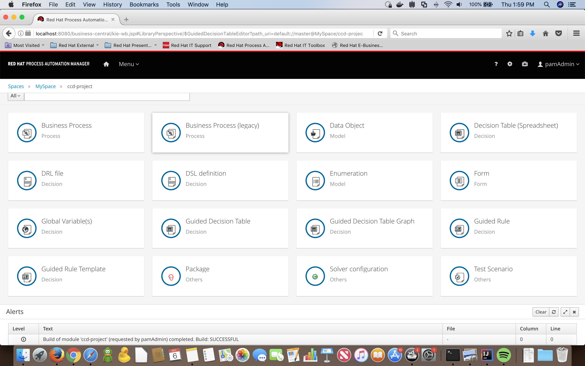
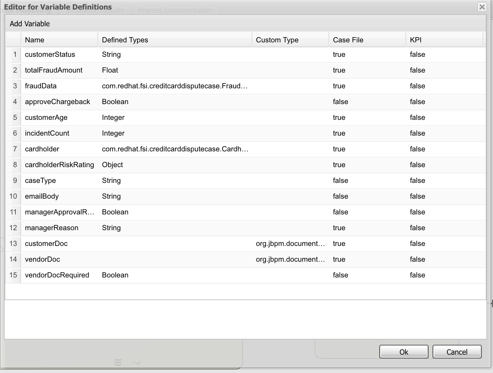
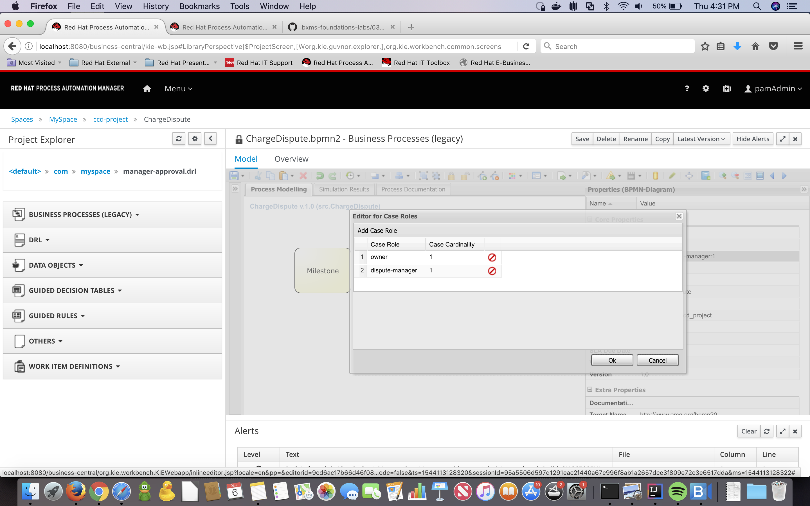

First steps to author a case.
-----------------------------

You will learn in this section:

1- Requisites to author your first case.

2- What are roles and variables.

Overview
----------
You are in charge of automating the whole process to solve a dispute, solving a credit card dispute depends on several variables like  the type of customer, the amount of the dispute etc. The knowledge of how to apply this rules and decisions is tacit, lives only in the head of other domain experts like you, in order to automate the process you have to first define what are the steps of the process.

What happens when a Credit Card Holder starts a dispute?

A Credit Card Dispute process is not a straightforward process, you don't start at point A and then follow the path to point B. What happens is that depending on the decisions made along the process, and most importantly the data of the case, you will jump back and forth between different steps to solve the dispute.
We have several Actors involved in the dispute.

_NOTE: Review the use case overview (step 1) where all the Actors are listed and defined._

As we saw earlier since this is a dynamic process, the best way to model it is as a Case, so we can have the flexibility. In a Case we have a goal: To solve the dispute, but the steps to do it are not well defined.
The Issuer will gather information from the Credit Card Holder and the merchant to store it in the Case File. This Case File can be accessed by all of the actors at any time, but you can also define Role Based Access Controls to protect the information.

Case management planning is typically concerned with determination of which Tasks are applicable, or which follow-up Tasks are required, given the state of the Case. Cases are directed not just by explicit knowledge about the particular Case and its context represented in the CaseFile, but also by explicit knowledge encoded as rules by business analysts, the tacit knowledge of human participants, and tacit knowledge from the organization or community in which participants are members.

NOTE: In real life the Issuer would deal with the Credit Card Processor and not the merchant directly but for the sake of simplicity we will just take the merchant into account.

*** The Modeler***
-------------------

To model cases and processes we have the modeller based on a technology called Stunner. Let's explore it in more detail.

1- _Modelling Canvas_ - this is your process drawing board. After dropping different shapes onto the canvas, you can move them around, connect them, etc. Clicking on a shape on the canvas allows you to set its properties in the expandable Properties Window (3) (as well as create connecting shapes and morph the shape into other shapes).

2- _Toolbar_ -The toolbar contains a vast number of functions offered by Designer (described later). These includes operations that can be performed on shapes present on the Canvas. Individual operations are disabled or enabled depending on what is selected. For example, if no shapes are selected, the Cut/Paste/Delete operations are disabled, and become enabled once you select a shape. Hovering over the icons in the Toolbar displays the description text of the operation.

3-  _Properties Panel_ - this expandable section on the right side of Designer allows you to set both process and shape properties. It is divided into four sections, namely "Core properties", "Extra Properties, "Graphical Settings" and "Simulation Properties". After clicking on a shape in the Canvas, this panel is reloaded to show properties specific to that shape type. If you click on the canvas itself (not on a shape) the panel displays general process properties.

4-  _Object Library Panel_ - the expandable section on the left side of Designer shows the jBPM BPMN2 (default) shape repository tree. It includes all shapes of the jBPM BPMN2 stencil set which can be used to assemble your processes. If you expand each section sub-group you can see the BPMN2 elements that can be placed onto the Designer Canvas (1) by dragging and dropping the shape onto it.

5- _View Tabs_ - currently Designer offers three tabs for Process Modelling, Simulation and Documentation. Process Modelling is the default tab. When users run process simulation, its results are presented in the Simulation tab. Process Documentation tab displays documentation generated from process definition.

6- _Info Tabs_ - there are two additional tabs at the top of Designer. The Editor tab includes the process modeling while the Overview tab displays the process metadata such as version history, creation date, last modification date etc.

Case Variables and Roles
------------------------

We have defined the Business Object Model and the Business Decisions on the last lab, so you need to import the following repository. You can watch the video about how to import a repository into your workspace

1- Login to business-central web console at http://ccd-project-rhpamcentr-ccd-project.[[HOST_SUBDOMAIN]]-80-[[KATACODA_HOST]].environments.katacoda.com/

user: developer
password: developer

2- Import the rest of the Domain Model and Decisions by importing the base project for this scenario from the following repository:

https://github.com/MyriamFentanes/case-management-scenario-base.git

[Youtube Importing a project](https://youtu.be/LUOw1TrYDWs)

To create your first Case:

1- Go to your library view and click on Add Asset, from the asset catalog select Case Definition (legacy), configure the following values:

Name: `ChargeDispute`{{copy}}  
Package: `com.myspace.ccd_project`{{copy}}

*** Defining Case Variables***

1- On the properties panel, In the Variable Definitions property field, click on the v icon to open the variable definitions editor, add the following values

Name:  `customerStatus`{{copy}}

    Defined Types: String

    Custom Type:

    Case File: true

    KPI: false

Name:  `totalFraudAmount`{{copy}}

    Defined Types: Float

    Custom Type:

    Case File: true

    KPI: false

Name:  `fraudData`{{copy}}

    Defined Types: FraudData

    Custom Type:

    Case File: true

    KPI: false

Name:  `approveChargeback`{{copy}}

    Defined Types: Boolean

    Custom Type:

    Case File: true

    KPI: false

Name:  `cardholder`{{copy}}

    Defined Types: CreditCardHolder

    Custom Type:

    Case File: true

    KPI: false

At the end you should have something like the following:

_NOTE: You may see more variables than the ones you have defined, we will import the rest of them later on the lab solution repository. What is important is for you to know how to define this variables._

***Roles***

People can have different roles in our case, the mapping to this roles is provided when the case instance is started, and can be changed afterwards.
Defining the roles

1- On the properties panel look for the Case Roles option and click on the V icon to the right.

2- Add the roles

Case Role: `owner`{{copy}}
Case Cardinality: 1

Case Role: `approval-manager`{{copy}}
Case Cardinality: 1

The cardinality refers to the number of actors that can be mapped to a role.

We have completed the setup of your case by defining the variables and the roles. The full definition can be found in the following repo:
NOTE: You will have to delete your current project first and then import the repository

https://github.com/MyriamFentanes/case-management-scenario-step3.git

Remember to examine the rest of the variables that were created for you.
