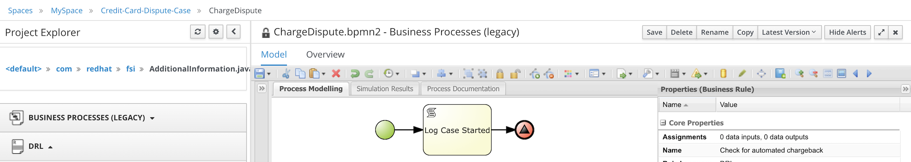
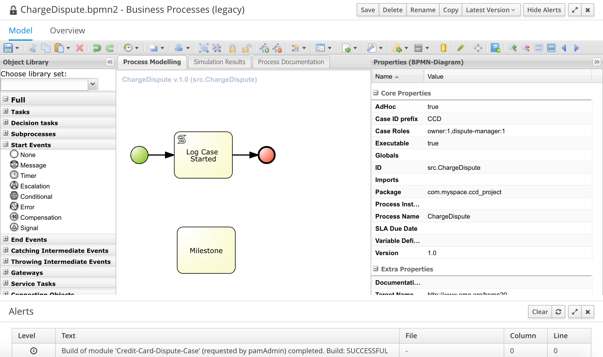
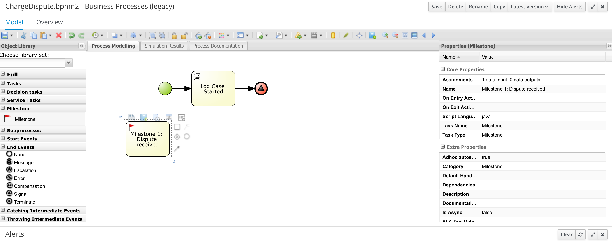
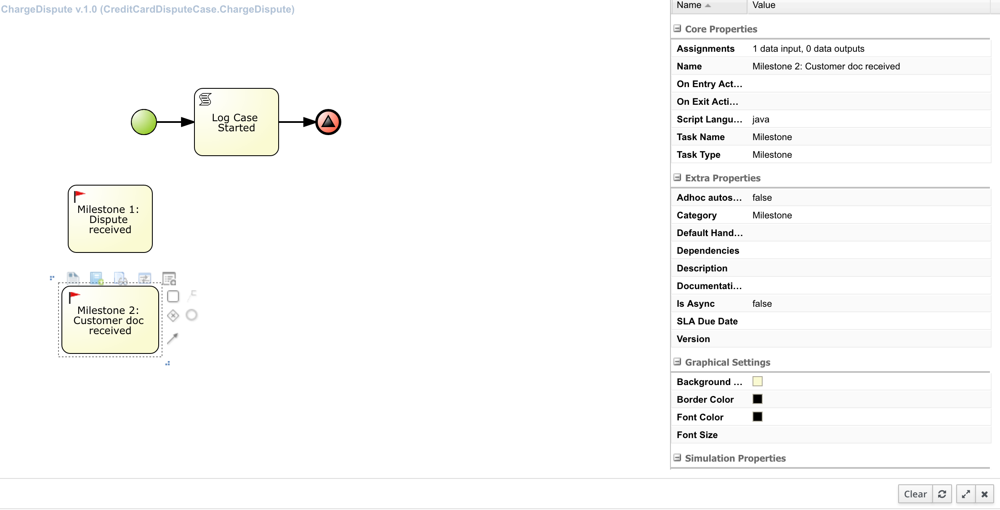

Firts steps to author a case.
-----------------------------

You will learn in this section:

1- How to model a case using Milestones.

2- How to apply the CMMN specification to Case Modeling .

The Credit Card dispute case
----------------------------

***Case Notation Specification***
----------------------------------
CMMN is a standard mantained by the OMG that defines the specification to graphically express a case, as we saw earlier in the overview there are some key components that we will use, like the following:

    - Case File: The Case information is represented by the CaseFile. It contains CaseFileItems that can be any type of data structure, CaseFile serves as context for raising events and evaluating Expressions as well as point of reference to guide the execution of the process, all the data including documents that we need to get to be bale to solve the dispute will be stored in the CaseFile.

    - Human Task: Is a Task that is performed by a Case worker.

    - Process Task: Can be used in the Case to call a Business Process.

    - Decision Task: Can be used in the Case to invoke a Decision. A Decision in CMMN is an abstraction of Decisions as they are specified in various Decision Modeling specifications.

    - Stages:  Stages may be considered “episodes” of a Case, though Case models allow for defining Stages that can be planned in parallel also. You would normally group tasks that logically belong together in a stage.

    - Milestone: Is a PlanItemDefinition that represents an achievable target, defined to enable evaluation of progress of the Case. No work is directly associated with a Milestone, but completion of set of tasks or the availability of key deliverables (information in the CaseFile) typically leads to achieving a Milestone.

Another characteristic of a case, is that it has a more dynamic lifecycle, in a regular process the final state is: finalized it can be due to completeness, error, or abortion of the process instance but once the process is terminated you can't restart it, with a case is different if for some reason the CC Holder is not happy with the decision of the dispute the lifecycle of the case allows the owner to reopen it. In the following picture we can see the lifecycle of a case.

Milestones of the Case
----------------------

Some of the steps described in the Use Case Overview (step 1) can be active in parallel or after you have completed them you can go back to the same step if necessary. Also some of the steps are discretionary so they might never be triggered. In order to follow the progress of the case we have Milestones.We will define the milestones or the targets that the dispute has to achieve to be solved.

1- Dispute started

2- Documentation received from CC Holder

3- Automated Chargeback processing

4- Manual processing

5- Account credited

6- Dispute rejected

This are the achievable targets to help us track the progress of teh dispute, they don't have any particular order, so you can come back to any of them if something in the Case File data changes

*** Defining Milestones ***
-----------------------------------

1- Login to business-central web console at http://ccd-project-rhpamcentr-ccd-project.[[HOST_SUBDOMAIN]]-80-[[KATACODA_HOST]].environments.katacoda.com/

In the previous step we have defined the case variables, if you did not complete that step, you may import the following repository. You can watch the video on how to import a repository into your workspace

https://github.com/MyriamFentanes/case-management-scenario-step3.git

To model the milestones of the case:

1- Select from the Object Library Panel a Node of type  Start event then add a Script node connected to this start event. On the properties panel for the Script node enter the following:

Name: `Log Case Started`{{copy}}
Script  `System.out.println("Case started");`{{copy}}

Add an end event of type signal and set the signal name to “Dispute Received”, so once you've completed Logging that the case has started the signal will trigger a Milestone called Dispute Received.

Signal Ref:  `Milestone 1: Dispute received`{{copy}}

2- Add a milestone node

Name:  `Milestone 1: Dispute received`{{copy}}
Ad hoc autostart: false

3- Save your process.

In this example we saw that Milestone can be triggered by signals, you can add logic after a milestone that will execute when the node is triggered. Another way to trigger a Milestone is when a condition on the data of the CaseFile is met.

4- Add a second Milestone

Name:  `Milestone 2: Customer doc received`{{copy}}
Ad hoc autostart: false

5- Look in the properties panel for the assignments section and click on the V icon, select the source property on the input assignment condition.
Select constant as the value and type

`org.kie.api.runtime.process.CaseData(data.get("customerDocReviewed") == true)`{{copy}}

In here we are checking that the variable customerDocReviewed is true to trigger Milestone 2: Customer doc received and consider that target as achieved. We will repeat the same process for the other milestones we defined at the beginning.

Name:  `Milestone 3: Automated Chargeback`{{copy}}
Condition:`org.kie.api.runtime.process.CaseData(data.get("automated") == true)`{{copy}}

This Milestones will be triggered by a signal

Name:  `Milestone 4: Account credited`{{copy}}
Condition:none

Name:  `Milestone 5:  Dispute rejected`{{copy}}
Condition:none

