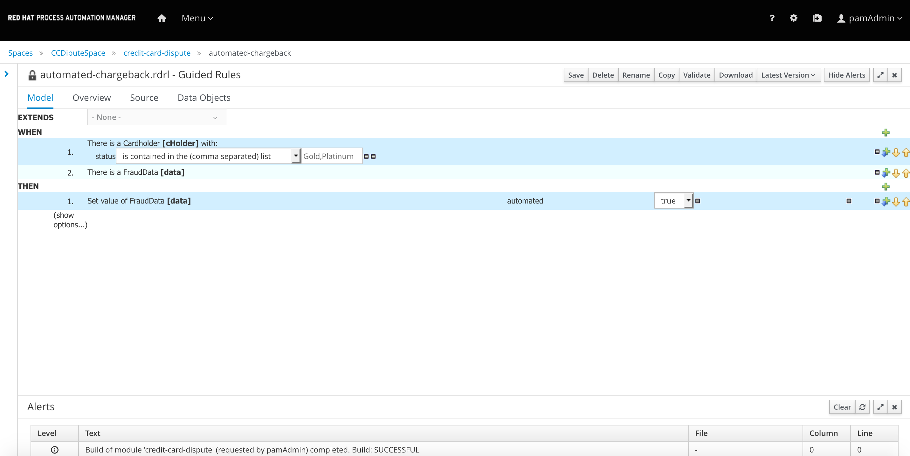
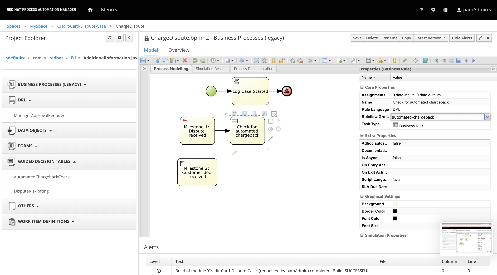

Decisions Integration.
----------------------

You will learn in this section:

1- How to further enhance your Case Model.

2- Integrating Decisions in the Case Model.

The Credit Card dispute case
----------------------------

There are several thing that could happen when you dispute a case, we will see 2 different scenarios

***Automated Chargeback***

A credit card dispute over billing errors has a good chance of being resolved in your favor thanks to the Fair Credit Billing Act, which regulates how credit card companies handle these disputes, or depending of the amount of the transaction or your status as a customer you can also qualify for an automated chargeback.
The process would look like:

1- CC Holder starts the dispute

2- The information of the case is evaluated and the decision of an automated chargeback is taken.

3- The issuer of the Credit Card (CC) will credit into your account the disputed amount.

Using Business Decisions in a Case
----------------------------------

In the previous step we defined the Milestones of the case, import the Case Model from the following repository:

https://github.com/MyriamFentanes/fsi-credit-card-dispute-case.git

To be able to decide the type of processing of the Credit Card Dispute we need to apply the rules for automatic chargeback processing that we automated in the previous scenario. The rules look something like this:

If you open the asset you will notice that we have added a extra property called rule-flow-group, this property is a meta-attribute that enables us to modify the execution of the rules, in this case we are grouping a set of rules to use them later on.

The evaluation to decide if a chargeback should be automatic is the first step after the Dispute is started, so we are going to add the step right after the Milestone: Dispute started is triggered. Remember that Milestones don't perform any actions are just to mark a target of the case as achieved, but we can link functionality to it. This nodes will start after the Milestones is triggered.

1-  Add a node of type Business Rule to the Milestone: Dispute started. In the properties panel add the following information:

Name:  `Check for automated chargeback`{{copy}}
Task Type: Business Rule
Rule Flow Group:

2- Add and end event node after the Business Rule "Check for automated chargeback"

You have just learned how to leverage the Desicions and Rules you author in the previous scenario, when a new case is started you will receive the data to process the Dispute. When you reach a Business Rule node in the Case Model this data stored in the Case variables. The variables can be of primitive type or reference the Object Model will be passed to the rules.

The evaluation of the rules can produce more data or modify the existing one, and all thsi will be stored in the case variables.

***Milestones ***
-----------------------------------

We have defined the case variables , if you want to skip to the next step you can import the following repository. You can watch the video on how to import a repository into your workspace

1- Import the rest of the Domain Model by importing the project Domain Model CC Dispute  from the following repository:

https://github.com/MyriamFentanes/fsi-credit-card-dispute-case.git

To model the milestones of the case:

1- Select from the Object Library Panel a Node of type  Start event then add a Script node connected to this start event. On the properties panel for the Script node enter the following:

Name: `Log Case Started`{{copy}}
Script  `System.out.println("Case started");`{{copy}}

Add and end event of type signal the name of the signal should be the same as the Milestone, so once you've completed Logging that the case has started the signal will trigger a Milestone called Dispute Received.

Signal Ref:  `Milestone 1: Dispute received`{{copy}}

2- Add a milestone node

Name:  `Milestone 1: Dispute received`{{copy}}
Ad hoc autostart: false

3- Save your process.

In this example we saw that Milestone can be triggered by signals, you can add logic after a milestone that will execute when the node is triggered. Another way to trigger a Milestone is when a condition on the data of the CaseFile is met.

4- Add a second Milestone

Name:  `Milestone 2: Customer doc received`{{copy}}
Ad hoc autostart: false

5- Look in the properties panel for the assignments section and click on the V icon, select the source property on the input assignment condition.
Select constant as the value and type

`org.kie.api.runtime.process.CaseData(data.get("customerDocReviewed") == true)`{{copy}}

In here we are checking that the variable customerDocReviewed is true to trigger Milestone 2: Customer doc received and consider that target as achieved. We will repeat the same process for the other milestones we defined at the beginning.

Name:  `Milestone 3: Automated Chargeback`{{copy}}
Condition:`org.kie.api.runtime.process.CaseData(data.get("vendorDocReceived") == true)`{{copy}}

This Milestones will be triggered by a signal

Name:  `Milestone 4: Account credited`{{copy}}
Condition:none

Name:  `Milestone 5:  Dispute rejected`{{copy}}
Condition:none

