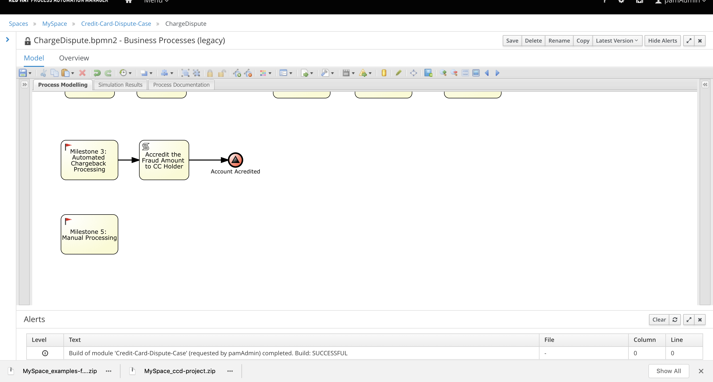
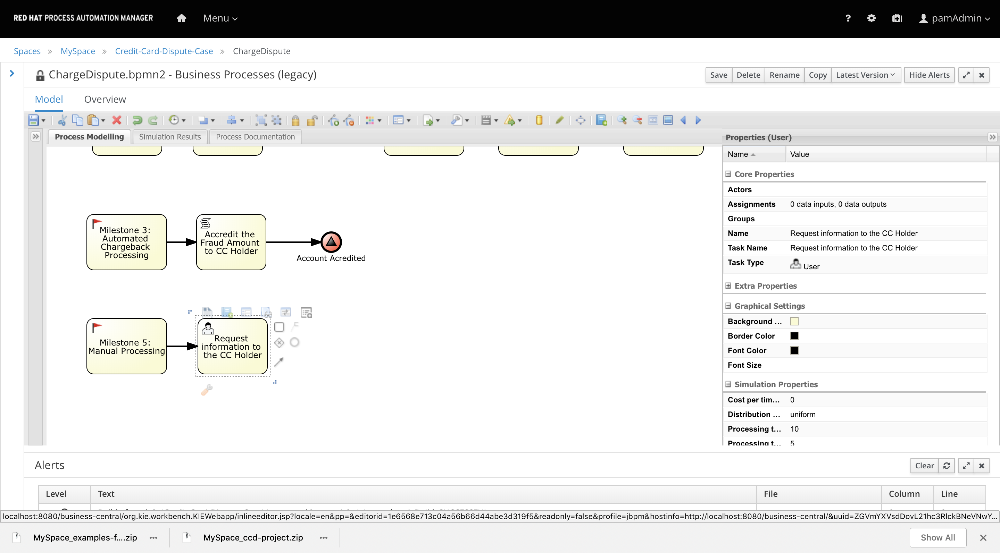
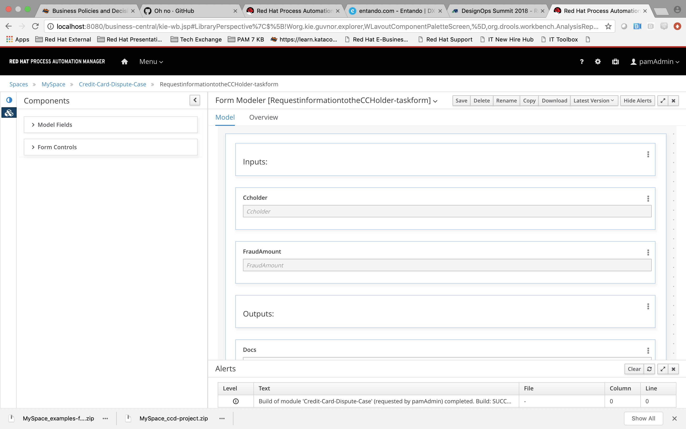
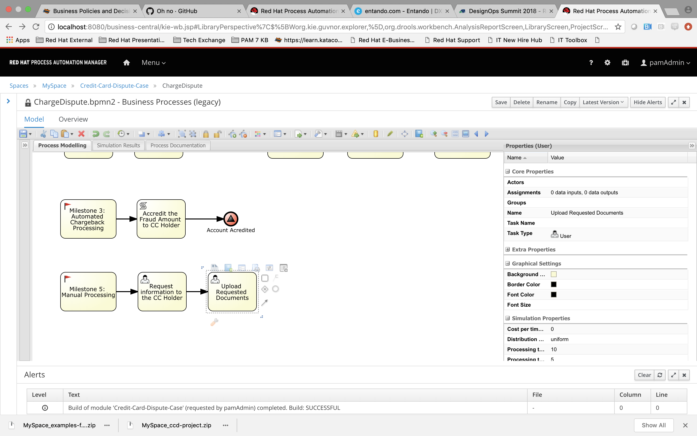
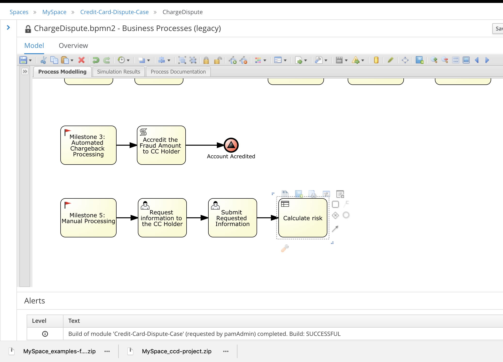
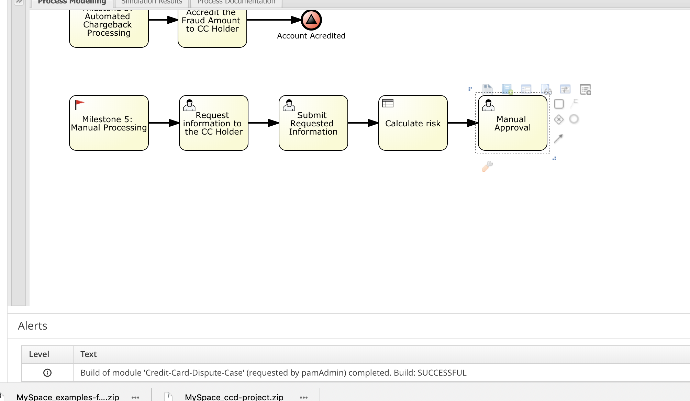
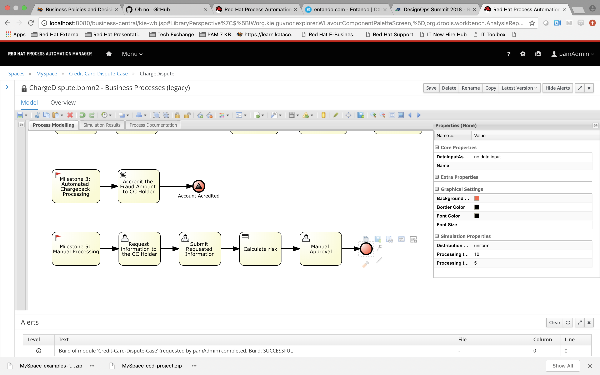
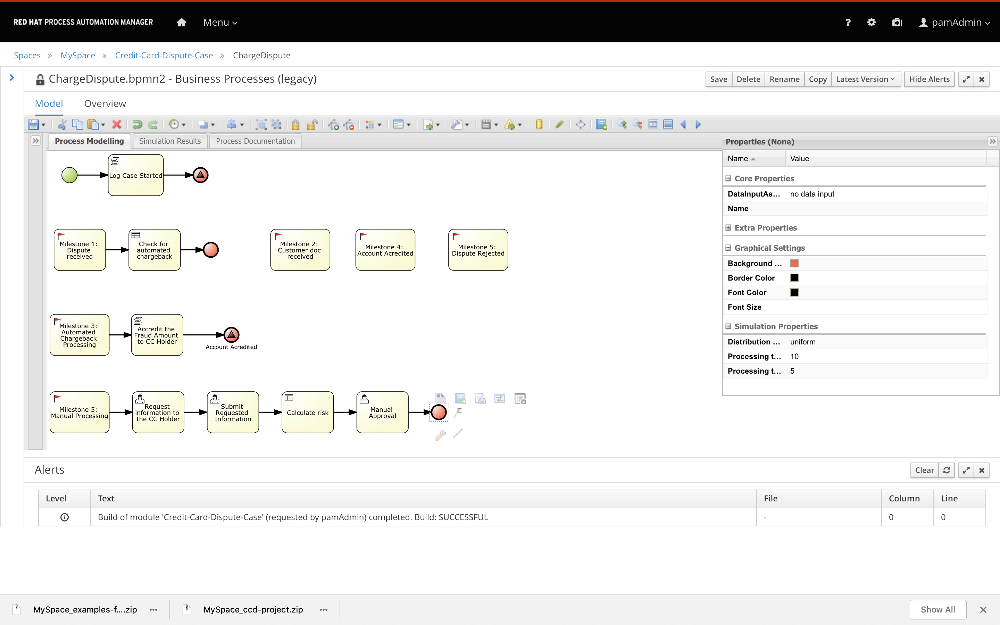

Human Task Integration.
-----------------------

You will learn in this section:

1- How to further enhance your Case Model.

2- Integrating Human Interaction in the Case Model.

The Credit Card dispute case
----------------------------

There are several thing that could happen when you dispute a case, we will see 2 different scenarios

***Manual Approval***

The next scenario involves a manual approval and further investigation to determine if the dispute is approved or rejected

1- CC Holder starts the dispute

2- The information of the case is evaluated and the decision of a non automated chargeback is taken.

3- A knowledge worker from the issuer bank reviews tha case file and determines the documents needed from the Credit Card Holder to solve the dispute.

4- The CC Holder submits the documents.

5- A knowledge worker reviews the documentation and determines if the documents are complete or if more information and docs are required, you go back to step3

6- If no more documents are needed from the CC Holder a knowledge worker has to determine if the Merchant needs tobe contacted tp request documents and then trigger again a review of the Merchant documentation

7- In parallel you have to evaluate the information of the case to determine if a manual approval is needed or you can just solve the case automatically with the information available.

We will now implement the logic for Manual Processing

***Using Human Tasks in a Case***

In the previous step we defined the Milestones of the case, and modeled the automatic chargeback functionality import the Case Model from the following repository:

https://github.com/MyriamFentanes/fsi-credit-card-dispute-case.git

The evaluation to decide if a chargeback should be automatic is the first step after the Dispute is started, we implemented that logic in the previous scenario, so we'll start assuming the chargeback was manual and the Milestone 5: Manual Processing was triggered.

Like in the previous step we will start the Manual processing once the Mielstone is triggered adding the functionality to the Milestone.

1-  Add a node of type User Task to the Milestone 5: Manual Processing . In the properties panel add the following information:

Name:  `Request information to the CC Holder`{{copy}}
Task Name:  `Request information to the CC Holder`{{copy}}
Task Type: User
group: `dispute-manager `{{copy}}

2- Now let's click on the Assignments property in the Properties Panel

In the assignments section is where you will define what is the data is needed in the Node to complete the task. This data can be of 2 types

- Data Inputs - Information that is in the process stored in variables. This data is needed by the user to perform an action inside the Node. Usually is immutable.

- Data Outputs- Information that we need from the user and that will be stored in the Case Variables

The definition of the inputs and outputs as well as the assignments of that data to variables of the case is done in this wizard. Request information to the CC Holder Data I/O

3- Generate the task Task form by clicking on teh option on the upper menu

4- Add a second task this time assigned to the credit card holder to upload extra information required and documents. Input the following information.

Name:  `Submit Requested Information`{{copy}}
Task Name:  `Submit Requested Information{{copy}}
Task Type: User
group: `dispute-manager `{{copy}}

***Documents**

Documents
-  Documents are special variables inside a process/case

-  They are applicable for the pluggable persistence strategies defined. Persistence strategies allow to provide various backend storage for process variables, instead of always be put together with process instance into jBPM data base.

5- Next we will add the rules to determine the risk of the Dispute. Add a node of type Business Rule to the Milestone: Dispute started. In the properties panel add the following information:

Name:  `Calculate risk`{{copy}}
Task Type: Business Rule
Rule Flow Group: `calculate-risk`{{copy}}

6-  Add a node of type User Task  after the Business Rule . In the properties panel add the following information:

Name:  `Manual Approval`{{copy}}
Task Name:  `Manual Approval`{{copy}}
Task Type: User
group: `dispute-manager `{{copy}}

7- Add and End Event and  Click save.

Your finished process should look something like this:

