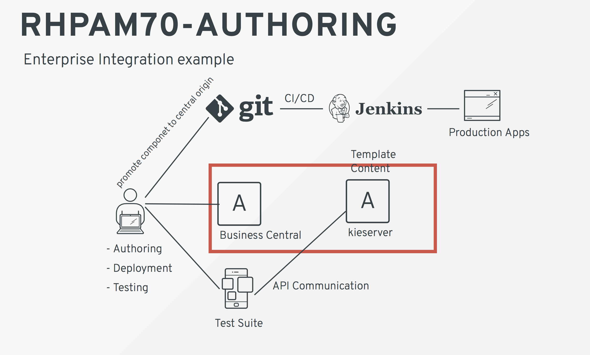

Red Hat Process Automation Manager is part of a rich set of tools to develop enterprise solution with multiple capabilities, thought to support multidisciplinary teams with teh right tool for every task a hand.

The native cloud environment was already provisioned for you, you can access it either using a terminal y you are a developer:
Login
-----

***Command line***

So for example you can log in as developer from the command line tool `oc login -u developer -p developer`{{execute}}

As you can see the IT engineers have already provision an environment for you, in a project called credit-card-dispute.

***Web Console***

If you don't want to interact with the platform from a command line terminal, you can also access the Web Console. The OCP Console is available on one of the tabs in your screen.

    - Login using the same credentials that you used before.

    - You will see a list of the projects that you have access to. In this case is only Credit Card Dispute.

** Red Hat Process Automation Platform **

When you click on the project you can see there are 2 deployments listed.

     - cc-dispute-kieserver
     - cc-dispute-rhpamcentr

 If you look at the diagram,this comprises your working environment.
 But what if you have special needs of tools and components? Or you simply want to know what you are working on.
 Lets go ahead and delete the whole project and start a new deployment based on your requirements.

     - Go back to your home page by clicking the home icon on the top left hand side.
     - Click on the kebab on the right hand side of your project name
     - Select Delete Project.
     - Type in ` credit-card-dispute`{{copy}}
     - Click on Delete.

Now what?
---------

****TEMPLATES****

 What is a template? Is an environments that follows a Red Hat prescriptive deployment architecture, to provide a fully working  platform for development, production, or SIT  to develop, integrate, test or run processes and other assets.
 The available templates are:

      -  rhpam70-authoring.yaml
      -  rhpam70-kieserver-externaldb.yaml
      -  rhpam70-kieserver-mysql.yaml
      -  rhpam70-kieserver-postgresql.yaml
      -  rhpam70-prod-immutable-kieserver.yaml
      -  rhpam70-prod-immutable-monitor.yaml
      -  rhpam70-prod.yaml
      -  rhpam70-sit.yaml
      -  rhpam70-trial-ephemeral.yaml

 The difference between them lies on what type of environment do you want?, what do you want it for?, with high availability or not? So for example if you want an environment to author rules and process, you have the rhpam70-authoring.yaml that contains all the components necessary to do so. See the image above.
 Quiz: From the previous step what components do you recognize in this template?

 In this particular case because you need a complete authoring environment with a process server where you can test your assets we could deploy the authoring environment, however due to the restrictions on this environment we will use the ephemera template instead.

You will be working in a development version of the Credit Card Dispute project, you need an environment that has no security restrictions, one of the new features in the Red Hat Process Automation Manager is the ability to just order a complete environment with just the components needed for your daily tasks.

