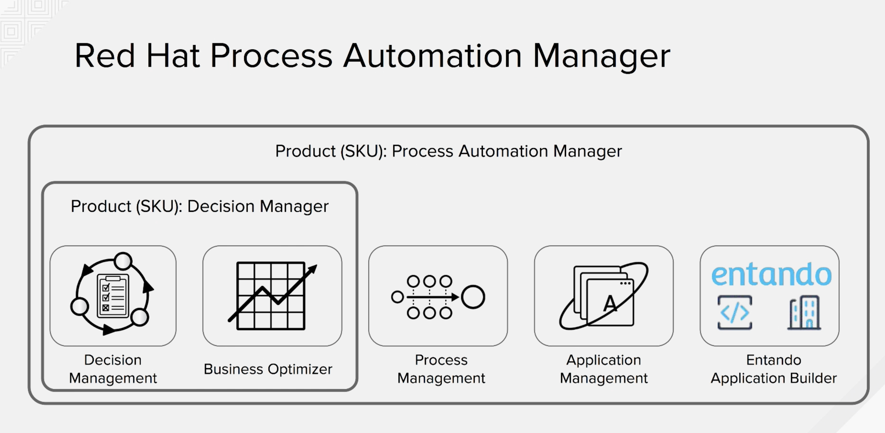

Setting up your work environment
--------------------------------

Red Hat Process Automation Manager enables you to automate different pieces of your requirements, you can automate the decision making, the flow of the decision making, the interaction between the people and systems, etc.
You need to become familiar with the environment to author, deploy, execute and manage your process instances, and take advantage of the cloud native environment available. Things such as Openshift sel-service console will allow you to provision, recreate, destroy  your working environment and be autonomous from other users .

The following diagram depicts the main components of Red Hat Process Automation Platform.

 

 - High Level Capabilities Components
 -------------------------------------

       - Decision Management a lightweight rules execution engine.

       - Business Optimization an AI optimizer for use cases like resource allocation, route planning and scenarios that involve fonding the optimal solution given certain constarints.

       - Process Management a lightweight process execution engine.

       - Business Central Console Modern workbench that provides user the tooling to build processes, rules, cases, monitor and manage.

       - Application Builder a digital experirence platform concentrated in tooling to build process driven applications, with widgets to build a UI for your automation services.

- Architectural components
-----------------------------------

      - Business Central Authoring-  To author any of the assests available in RHPAM

      - Asset Repository: To be collaborative all of the assets that you develelop will be stored in a git based asset repository, this will allow to version, index, search and share your work with the rest of your team.

      - Artifact Repository:  Once you have completed the authoring phase and you are satisfied with the work you can create a deployment unit within the workbench this unit will be stored in the artifact repository.

      - Controller: The deployment units created and stored once tested are deployed by the Controller to the Execution Engine in common scenarion where you have a clustered environment or heterogenous topologies that map the relations and dependencies between the lines of business, the controller absorbs all the complexity of keeping your environment configured according to what you have specified using a template.

      - Kie Server: Is the actual component that will execute the rules and processes contained in the deployment unit, you can scale them horizontally or vertically in an aiutomatic fashion using the cloud native capabilities of Openshift Container Platform. Since the state of the process is stored in the database youcan consider the kie-servers stateless when it comes to process execution.

      -  Smart Router: In classical enterprise environment where you have multiple instances running and different nodes starting or shutting down in an elastic way the complexity of tracking this chamges to load balance the requests accordingly goes to the Smart Router.

