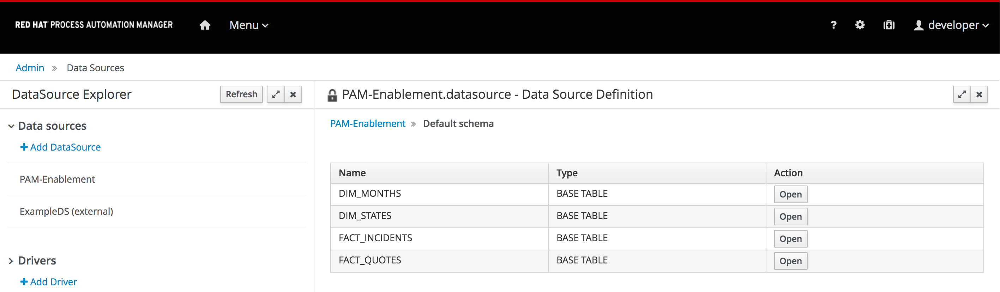

Before we can build a reporting page, we first need to define and create a so called *DataSet* that will provide the data that our report(s) will render.

As mentioned in the introduction of this scenario, a DataSet in Process Automation Manager 7 can be based on various data providers, including Java Beans, CSV and SQL. In this example we will use a DataSet that uses the SQL provider.

For this scenario, we’ve prepared a database with task data and customer satisfaction data of our *Credit Card Dispute* use-case. The database is a pre-provisioned PostgreSQL database running in our OpenShift environment.

* Host: `postgres`{{copy}}
* Port: `5432`{{copy}}
* User: `postgres`{{copy}}
* Password: `postgres`{{copy}}
* Database: `postgres`{{copy}}

In Business Central, you can use this information to create a new *DataSource* that we can later use in our *DataSet*.

Before we can create a new *DataSource*, we first need to install the correct driver for our database.

---
**NOTE**

Process Automation Manager 7 can come with pre-provisioned database-drivers for MariaDB, MySQL and PostgreSQL, depending on the configuration settings of the platform. If your version already comes with a pre-configured PostgreSQL driver, you can skip the steps of adding the driver.

---

1. Go to the “Settings” screen by clicking on the gear icon in the upper right corner: 
2. Click on the *Data Sources* tile.
3. In the *Drivers* section, click on *+ Add Driver*.
4. In the *New driver* from, entering the following values and click on *Finish*:
  * Name: `PostgreSQL`{{copy}}
  * Driver Class Name: `org.postgresql.Driver`{{copy}}
  * Group Id: `org.postgresql`{{copy}}
  * Artifact Id: `postgresql`{{copy}}
  * Version: `9.4.1212.jre7`{{copy}}

Next, we can create the *DataSource* that connects to our PostgreSQL database.

1. In the *Data Sources* screen, click on *+ Add DataSource* on the left-hand side of the screen, which will open the *New data source form*.
2. Fill in the following values:
  * Name: `PAM-Workshop-Reporting`{{copy}}
  * Connection URL: `jdbc:postgresql://postgresql:5432/postgres`{{copy}}
  * User: `postgres`{{copy}}
  * Password: `postgres`{{copy}}
  * Driver: `PostgreSQL`
3. Click on “Test Connection” to test the setup and if the test is OK, click on “Finish”

Now that we've created the DataSet, we can explore its content.

1. Click on the *PAM-Workshop-Reporting* DataSet that we've just created.
2. Click on the *Browse content* button at the top of the panel. This will open the *Schemas* of the datasource.
3. Click on thew *Open* button of the `public` schema.

3. The `public` schema of our database contains two tables. One `task` table which contains the open and completed tasks of our credit-card dispute cases, and a `customer_satisfaction` table which contains information of the customer satisfaction related to our credit-card dispute cases.
4. Click on the *Open* button next to the `task` table and explore the table's content.
5. Go back to the *public* schema page and click on the *Open* button next to the `customer_satisfaction` table and explore the table's content.

Now that we've created a connection to our PostgreSQL *DataSource* we can define the *DataSets* that we will use to render our reports.
