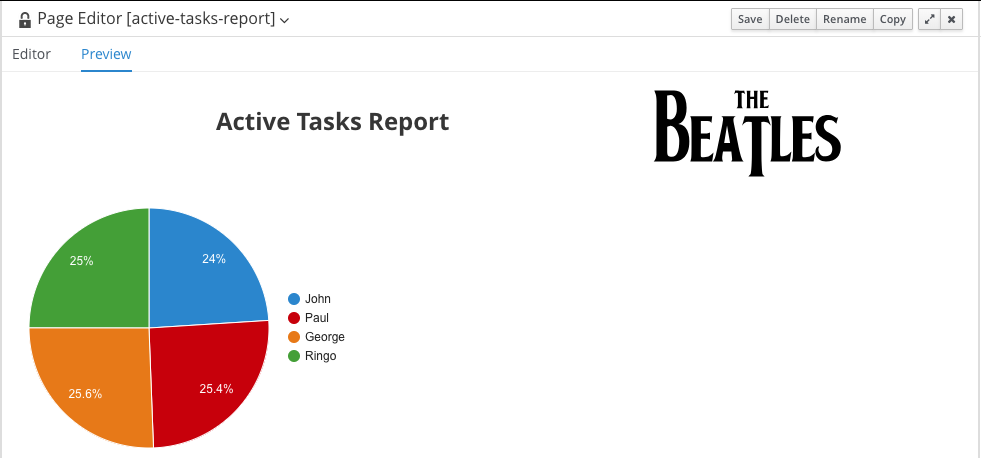
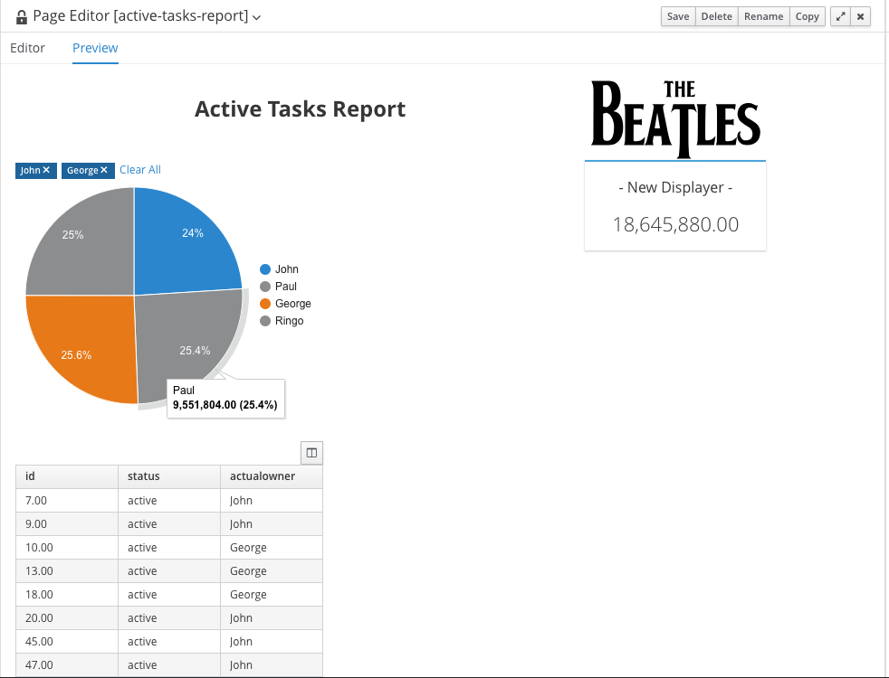

With our *Data Source* and *Data Set* configured, we can now create our report. We will first create a report for our tasks,

Red Hat Process Automation Manager 7 uses its new Form Modeler technology, the modeler that's also used to build process and tasks forms, to build reports. The platform provides a vast array of reporting components that can be used in forms in pages. Furthermore, the reporting components can be easily combined with other Form Modeler components, allowing the user to build rich reporting pages and interfaces.

Reports are created as so called *Pages* in the Process Automation Manager Business Central workbench. We there need first need to configure a page in which we can define the report.

1. Go to *Menu* -> *Design* -> *Pages* and click on the *New Page* button in the middle of the screen.
  * Name: `active-tasks-report`{{copy}}
  * Style: `Fluid`
2. The Process Automation Manager drag-and-drop *Page Editor* will open.
3. Explore the *Components* palette. Note that there 3 different types of components, *Core*, *Navigation* and *Reporting*.
4. Open the *Reporting* components palette. Observe that the *Reporting* menu has various reporting components, like *Bars*, *Pie Charts*,  *Lines*, *Meters* and *Maps*.
5. From the *Core* menu, drag the *HTML* component to the top of the page. This will open the *HTLM Editor*.
6. In the *HTML Editor*. Align the text in the centre, enable the *Bold* font and select *h1 (Big Title)*. Write the text "Active Tasks Report"{{copy}} and click on *Ok*.
7. From the *Reporting* components, drag the *Pie* onto the page. In the *New Displayer* configuration page, click on the *Data* tab and select the *active_tasks_per_owner* Data Set. Next, select *actualowner* in the *Categories* drop-down list and click on *Ok*.
8. As we want to make the page a bit more attractive, we add a logo to the top of our screen, next to the report title in the top right corner. From the *Core* components, drag the *HTML* component onto the page and place it next to the page title. In the *HTML Editor* click on the image icon. In the form that opens, use the following URL for the image `https://upload.wikimedia.org/wikipedia/commons/b/b0/Beatles_logo.svg`{{copy}} and click *Ok*. Remove the "Add your HTLM here..." text and click *Ok*.
9. Both the report's title and the logo component now have roughly the same size. You can change the size of the components so the Logo will be placed in the top right corner. Move your mouse in-between the components and click when the "->" arrow appears to increase the size of the title component and decrease the size of the image component. Repeat this until you're happy with the layout of your report.
8. Save the page by clicking on the *Save* button on the top of the screen.
9. Hoover over the pie-chart to reveal more information.

The page should somewhat look like this:

We will now demonstrate how different reporting components can interact with each other when they use the same *Data Set*. To demonstrate this we will add a metric component that sums the number of tasks and a list that shows the actual tasks.

1. From the *Reporting* components, drag the *Metric* component onto the page, next to the pie chart.
2. In the *New Displayer* configuration page, click on the *Data* tab and select the *active_tasks_per_owner* Data Set and click on *Ok*.
3. Make the *Metric* component a bit smaller.
4. From the *Reporting* components, drag the *Table* component on to the page and place it under the pie chart component.
5. In the *New Displayer* configuration page, click on the *Data* tab and select the *active_tasks_per_owner* Data Set and click on *Ok*.
6. Save the page by clicking on the *Save* button on the top of the screen.

To demonstrate the filter functionality of the *Data Set* and the components that use it, click on "John's" tasks in the pie-chart. This will enable the filter on the *Data Set*, which dynamically changes the other reporting components that use the same data. Som the *Metric* component now shows the sum of John's tasks, and the table component now only shows tasks of which John is the owner.

We can also select a second user, for example "George", to filter just the tasks owned by John and George. Note how the other components adapt to the filters.

Finally, the filters can be cleared by either clicking in the pie-chart, or removing the items from filter row at the top of the component.

